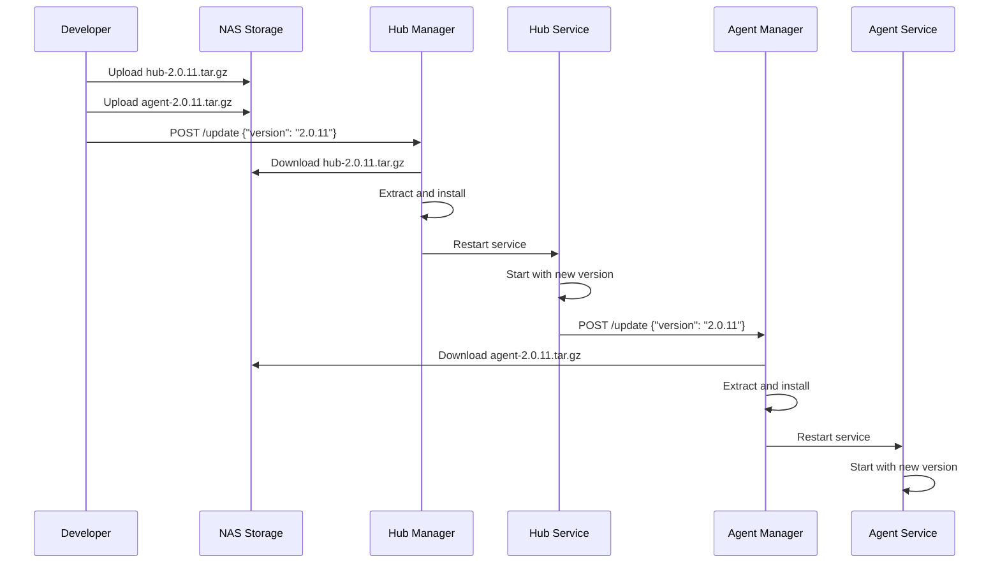

# Manager Architecture Documentation

## Overview

The Backend AI system uses a consistent manager pattern across all components:
- **Hub Manager** (port 3081) - Controls the hub lifecycle
- **Agent Managers** (port 3081) - Control agent lifecycles on each machine

This architecture ensures consistency - just like having all file servers run on the same port across different machines.

## Architecture Principles

### Separation of Concerns
- **Managers** (port 3081): Lifecycle control only (start/stop/update)
- **Services** (hub: 3000, agents: 3080): Business logic and functionality

### Consistency
- All managers run on port 3081
- All managers expose the same endpoints
- All managers use the same response formats

## Hub Manager

Located at: `http://192.168.1.30:3081` (localhost only)

### Purpose
The hub manager is a minimal service that controls the hub's lifecycle. It has no business logic - it only starts, stops, and updates the hub service.

### Endpoints

#### GET /status
Check if the hub is running
```bash
curl http://localhost:3081/status
# Response: {"running": true}
```

#### POST /start
Start the hub service
```bash
curl -X POST http://localhost:3081/start
# Response: {"success": true}
```

#### POST /stop
Stop the hub service
```bash
curl -X POST http://localhost:3081/stop
# Response: {"success": true}
```

#### POST /restart
Restart the hub service
```bash
curl -X POST http://localhost:3081/restart
# Response: {"success": true}
```

#### POST /update
Update the hub to a new version
```bash
curl -X POST http://localhost:3081/update \
  -H "Content-Type: application/json" \
  -d '{"version": "2.0.11"}'
# Response: {"success": true, "message": "Hub update to version 2.0.11 started"}
```

#### GET /version
Get the current hub version
```bash
curl http://localhost:3081/version
# Response: {"version": "2.0.10", "name": "@proxmox-ai-control/hub"}
```

#### GET /logs
Get hub service logs
```bash
curl http://localhost:3081/logs?lines=50
# Response: {"service": "ai-hub.service", "lines": 50, "logs": "..."}
```

### How Hub Update Works
1. Manager receives update request with version number
2. Manager downloads hub package from NAS: `http://192.168.1.10:8888/api/raw/{version}/hub-{version}.tar.gz`
3. Manager backs up current hub dist directory
4. Manager extracts new version
5. Manager restarts hub service via systemd

## Agent Managers

Located at: `http://{agent-ip}:3081`

### Purpose
Each agent has its own manager that controls the agent's lifecycle. Like the hub manager, it has no business logic.

### Endpoints
Identical to hub manager:
- GET /status
- POST /start
- POST /stop
- POST /restart
- POST /update
- GET /version
- GET /logs

### How Agent Update Works
1. Hub tells agent manager to update to specific version
2. Manager downloads agent package from NAS: `http://192.168.1.10:8888/api/raw/{version}/agent-{version}.tar.gz`
3. Manager backs up current agent dist directory
4. Manager extracts new version
5. Manager restarts agent service

## Deployment Flow

### 1. Manual Deployment
```bash
# Deploy new version
./update-versions.sh 2.0.11

# This script:
# 1. Builds hub and agent with version 2.0.11
# 2. Uploads both to NAS in /2.0.11/ folder
# 3. Tells hub manager to update hub
# 4. Hub automatically updates all agents
```

### 2. What Happens During Deployment



## Implementation Details

### Manager Service Configuration
Both hub and agent managers run as systemd services:

```ini
[Unit]
Description=Backend AI Hub Manager
After=network.target

[Service]
Type=simple
User=root
WorkingDirectory=/opt/backend-ai/hub
ExecStart=/usr/bin/node /opt/backend-ai/hub/dist/manager/index.js
Restart=always
```

### Security Considerations
- Hub manager listens on 127.0.0.1 only (localhost)
- Agent managers listen on 0.0.0.0 (accessible from hub)
- No authentication on managers (rely on network security)
- Managers can only control their local service

### Directory Structure
```
/opt/backend-ai/
├── hub/
│   ├── dist/
│   │   ├── api/          # Hub API (port 3000)
│   │   └── manager/      # Hub Manager (port 3081)
│   └── package.json
└── agent/
    ├── dist/
    │   ├── api/          # Agent API (port 3080)
    │   └── manager/      # Agent Manager (port 3081)
    └── package.json
```

## Key Benefits

1. **Consistency**: All managers on port 3081, same API
2. **Simplicity**: Managers only do lifecycle management
3. **Reliability**: Manager can restart crashed services
4. **Clean Updates**: Coordinated updates through managers
5. **Separation**: Business logic separate from lifecycle control

## Troubleshooting

### Check Manager Status
```bash
# Hub manager
ssh root@192.168.1.30 "systemctl status ai-hub-manager"

# Agent manager (example: nginx)
ssh nginx "systemctl status ai-agent-manager"
```

### View Manager Logs
```bash
# Hub manager logs
ssh root@192.168.1.30 "journalctl -u ai-hub-manager -n 50"

# Agent manager logs
ssh nginx "journalctl -u ai-agent-manager -n 50"
```

### Manual Service Control
If manager is down, you can still control services directly:
```bash
# Hub
systemctl start/stop/restart ai-hub.service

# Agent
systemctl start/stop/restart ai-agent.service
```

## Summary

The manager architecture provides a clean, consistent way to control service lifecycles across your infrastructure. By separating lifecycle management (port 3081) from business logic (ports 3000/3080), the system remains simple, reliable, and easy to understand.